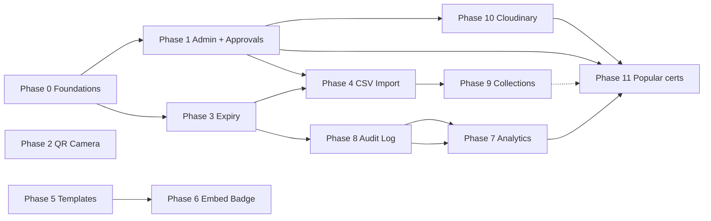

# MAScertify — Feature Implementation Plan

This document sequences work to complete the platform: **admin & approvals**, **verification UX**, **bulk issuance**, **templates**, **embeddable badges**, **analytics**, **audit logging**, **collections**, **Cloudinary-backed media**, and a **public “popular certifications” discovery** experience (browse → course detail → organization website). It is written against the current codebase (Express + Mongoose + React/Vite). **No outbound email** — all workflows stay in-app.

---

## Current baseline (what exists today)

| Area | Status |
|------|--------|
| Auth | JWT, roles: `user`, `organization`, `admin` (admin UI/routes largely absent) |
| Organizations | `Organization` model includes `approved: Boolean` (default `false`) — **not enforced** on certificate routes |
| Certificates | CRUD, revoke, public `GET /api/certificates/verify/:id`, `expiryDate`, `status` enum includes `expired` |
| Verify page | Text lookup works; **QR “Scan” mode is a placeholder** (“Camera not active in demo”) |
| PDF / QR on cert | `qrcode.react`, html2canvas, jsPDF on client |

Gaps to close globally before or alongside features: **enforce org approval** where appropriate, **derive `expired` from dates** (cron or on-read), **indexes** on hot fields (`certificateId`, `organizationId`, timestamps, foreign keys for new collections).

---

## Guiding principles

1. **Backend is source of truth** for status, analytics aggregates, and audit entries.
2. **Public verify** stays unauthenticated but should **write audit rows** (and optionally rate-limit).
3. **Admin** actions are separate routes under `/api/admin/*` with `adminOnly` middleware (mirror `orgOnly`).
4. Prefer **additive** schema changes with defaults so existing data keeps working.

---

## Phase 0 — Foundations (do first)

| Task | Notes |
|------|--------|
| Admin guard + bootstrap | `adminOnly` middleware; seed or env-based first admin user; never expose “promote self” without existing admin |
| Enforce `organization.approved` | Block org certificate create/bulk/import until approved; return clear API errors; dashboard banner when pending |
| Expiry resolution | On verify and on org list/detail: if `expiryDate < now` and not revoked → treat or persist `status: 'expired'`; optional nightly job to bulk-update |
| Environment | Document new vars: `APP_BASE_URL` (for badge/embed URLs), **Cloudinary** (`CLOUDINARY_CLOUD_NAME`, `CLOUDINARY_API_KEY`, `CLOUDINARY_API_SECRET`, optional upload folder/preset), etc. |

---

## Phase 1 — Admin panel & organization approval workflow

**Goal:** Operators can review new orgs, approve/reject, and see org metadata.

| Layer | Work |
|-------|------|
| Data | Extend `Organization`: `approvalStatus` enum `pending \| approved \| rejected`, `reviewedAt`, `reviewedBy`, `rejectionReason` (optional); migrate from boolean `approved` or sync both during transition |
| API | `GET /api/admin/organizations` (filters: status), `PATCH /api/admin/organizations/:id` (approve/reject), optional notes |
| UI | New `/admin` routes (protected `admin` role): queue table, detail drawer, approve/reject actions |
| UX | In-app status only (pending / approved / rejected visible on org dashboard and admin queue) |

**Exit criteria:** Pending orgs cannot issue certs; approved orgs can; admins can complete the full review loop from the UI.

---

## Phase 2 — Real QR camera scanning (`html5-qrcode`)

**Goal:** Browser camera decodes QR payload and resolves to certificate ID or verification URL.

| Layer | Work |
|-------|------|
| Client | Add `html5-qrcode`; replace placeholder in `Verify.jsx` scan mode; start/stop scanner on tab change; handle HTTPS + permissions errors gracefully |
| Payload | Standardize QR content as full URL `https://<app>/verify?id=MASC-XXX` or `https://<app>/certificate/MASC-XXX` — parse ID from decoded string |
| Security | Do not trust arbitrary URLs; **only** accept same-origin paths or strict regex for `MASC-` IDs |

**Exit criteria:** On a phone or laptop with camera, scanning a cert QR opens verification flow without manual typing.

---

## Phase 3 — Certificate expiry auto-detection & warnings

**Goal:** System and users see accurate expiry state and upcoming risk.

| Layer | Work |
|-------|------|
| Server | Central helper: `resolveCertificateStatus(cert)`; use in verify response and org APIs; optional Mongoose pre-save / daily cron to mark `expired` |
| Org UI | Dashboard filters/badges: expiring in 30/60/90 days; list sort by expiry |

**Exit criteria:** Expired certs never show as “active”; org dashboard highlights soon-to-expire rows.

---

## Phase 4 — Bulk CSV import

**Goal:** Upload CSV → validate rows → create many certificates in one job.

| Layer | Work |
|-------|------|
| Data | `ImportJob` model: `organizationId`, `status`, `totalRows`, `successCount`, `errorCount`, `errors[]`, `createdBy`, timestamps |
| API | `POST /api/certificates/import` (multipart file), `GET /api/certificates/import/:jobId` for status; **org must be approved** |
| Processing | Stream/parse CSV (e.g. `csv-parse`); cap row count per request; validate columns: `recipientName`, `courseName`, `issueDate`, optional `recipientEmail`, `description`, `expiryDate`, `templateId`, `collectionId` |
| UI | Import wizard: template download, mapping hints, progress, error report download |

**Exit criteria:** 100+ rows import without blocking the event loop unreasonably; partial failure returns per-row errors.

---

## Phase 5 — Certificate templates (multiple visual designs)

**Goal:** Org selects a template; PDF and on-screen certificate match.

| Layer | Work |
|-------|------|
| Data | `Certificate.templateId` or `templateKey` enum/string; optional `Template` collection if templates are DB-driven later |
| Client | Extract presentational layout from `CertificateDetail` / PDF flow into components: `templates/minimal`, `templates/academic`, etc. |
| API | Accept `template` on create/import; validate against allowlist |

**Exit criteria:** At least 2 distinct designs; choice persists on cert record and PDF export.

---

## Phase 6 — Embeddable verification badge

**Goal:** Recipients embed “Verified by MAScertify” on LinkedIn or personal sites.

| Layer | Work |
|-------|------|
| Public asset | Lightweight `GET /embed/badge.js` or static iframe page ` /embed/cert/:id` that shows status (avoids heavy SPA) |
| CORS | If JSONP/script tag: documented snippet; sanitize output |
| Docs | Snippet copy-paste in certificate detail page |

**Exit criteria:** One copy-paste HTML block works on a third-party page and reflects current status (active/revoked/expired).

---

## Phase 7 — Organization analytics dashboard

**Goal:** Issue trends and verification counts per org.

| Layer | Work |
|-------|------|
| Data | Prefer **pre-aggregated** counters updated on events (issue, verify) for fast dashboards, or MongoDB aggregations on `AuditLog` / certs with date range; maintain **verify count per org + course bucket** (`organizationId` + `publishedCourseId` or `collectionId` from cert/listing linkage) for discovery sorting |
| API | `GET /api/organizations/analytics?from=&to=` — series for issues, verifications, revocations |
| UI | Charts (e.g. Recharts) on dashboard or `/dashboard/analytics` |

**Exit criteria:** Default range (e.g. last 30 days) loads in under two seconds for typical org sizes on indexed data.

---

## Phase 8 — Audit log (every verification attempt)

**Goal:** Immutable-enough log for compliance and debugging.

| Layer | Work |
|-------|------|
| Data | `AuditLog` model: `event: 'verification_attempt'`, `certificateId`, `outcome: found \| not_found \| error`, `ip`, `userAgent`, `timestamp`, optional `organizationId` (resolved if cert found), optional **`publishedCourseId` / `collectionId`** when the certificate maps to a discoverable course bucket (powers per–org/course verify totals) |
| API | `GET /api/organizations/audit-logs` (org-scoped, paginated); `GET /api/admin/audit-logs` (global, optional) |
| Hook | In `GET /verify/:id` (and scanner flow client hits same API), **after** response logic, `insertOne` audit row (fire-and-forget; don’t fail verify on log error) |

**Exit criteria:** Every lookup creates a row; org can export CSV or page through history.

---

## Phase 9 — Certificate collections (course, event, cohort)

**Goal:** Group certificates for reporting, import defaults, and filtering.

| Layer | Work |
|-------|------|
| Data | `Collection` model: `organizationId`, `name`, `type` enum (`course` \| `event` \| `cohort` \| `other`), `metadata`, `createdAt`; `Certificate.collectionId` optional ref |
| API | CRUD collections; filter certs by `collectionId`; CSV import can assign collection |
| UI | Collection picker on create/import; dashboard filter |

**Exit criteria:** Org creates “Spring 2026 Cohort”, bulk-imports into it, analytics can scope to that collection.

---

## Phase 10 — Cloudinary image storage (platform media)

**Goal:** Reliable hosting for org logos, course listing imagery, and optional galleries—without bloating MongoDB with binary data.

| Layer | Work |
|-------|------|
| Server | Add `cloudinary` SDK; central helper `uploadStream` / `uploadBuffer` with consistent `folder` (e.g. `mascertify/orgs/{orgId}`, `mascertify/courses/{courseId}`); return `secure_url` + `public_id` for deletes |
| Auth | **Do not** expose API secret to the browser; use **signed upload** (`api/sign-upload` returning timestamp + signature) or **server-side multipart** proxy (`POST /api/media/upload` with `protect` + `orgOnly`) |
| API | `POST /api/media/upload` (field `file`, optional `context: logo \| course_hero \| course_gallery`); `DELETE /api/media/:publicId` (authorize ownership); validate MIME (jpeg/png/webp) and max size |
| Data | Store URLs or `{ publicId, url }` on `Organization.logo` and on published course documents (Phase 11); on org/course delete, optionally remove Cloudinary assets (or orphan cleanup job) |
| Client | Reuse upload component in org profile and course editor; show upload progress and preview |

**Exit criteria:** Org can replace logo and course hero image; images load from Cloudinary CDN; secrets never ship to client bundles.

---

## Phase 11 — Popular certifications: discovery, course pages & admin moderation

**Goal:** Logged-out users browse **trending / popular courses** (scroll-friendly), open a **course detail** page with copy and imagery, and follow a **Visit organization website** link. **Organizations** edit their listing content; **admins** approve what appears publicly and can remove listings from the directory.

### Conceptual model

Treat a **listed course** as a marketing/discovery record (not the same as a single issued certificate). It may **link** to Phase 9 `Collection` or to a canonical course name used on certificates, but the public page is its own document so copy, images, and moderation state stay stable.

| Layer | Work |
|-------|------|
| Data | New model `PublishedCourse` (name TBD: `CourseListing`, `DiscoverableCourse`): `organizationId`, `slug` (unique), `title`, `summary`, `description` (markdown or sanitized HTML), `heroImage` / `gallery` (Cloudinary refs from Phase 11), `websiteUrl` (optional override; fallback `Organization.website`), `listingStatus` enum `draft \| pending_review \| published \| rejected \| delisted` (admin removal), `submittedAt`, `reviewedAt`, `reviewedBy`, `rejectionReason`, optional `linkedCollectionId` — **no separate “popularity score” field required** |
| Org API | `GET/POST/PATCH /api/org/courses` (scoped to org): create draft, edit content, upload images via Phase 10, **submit for review** (`pending_review`), unpublish to draft where allowed |
| Public API | `GET /api/discover/courses` — only `listingStatus === 'published'`; query `sort=popular` (default), pagination; optional filters (category, org type) later |
| Public API | `GET /api/discover/courses/:slug` — detail for published listings only; include org display name + resolved `websiteUrl` |
| Admin API | `GET /api/admin/course-listings?status=pending_review`, `PATCH .../approve` → `published`, `PATCH .../reject`, `PATCH .../delist` (hides from public immediately; org sees “removed by platform” state) |
| Public UI | Route `/discover` or `/certifications`: horizontal scroll or responsive grid of cards (hero image, title, org, popularity badge); `/discover/:slug` detail: full description, gallery, primary CTA **Open organization website** (`target="_blank"` `rel="noopener noreferrer"`) |
| Org UI | Dashboard section **“Public course pages”**: editor for each listing, preview (optional), submit for review, status indicator |
| Admin UI | Queue for pending listings; approve/reject/delist; audit who acted and when |

### Popularity (single rule)

**Sort “popular” listings by verification count** from Phase 7 analytics: aggregate **successful** `verification_attempt` rows (Phase 8 `AuditLog`) bucketed by **`organizationId` + course key** — the key is `publishedCourseId` when the verified certificate is tied to that listing (or `collectionId` if you key buckets by collection). Increment or roll up in the same counters Phase 7 exposes so `/api/discover/courses?sort=popular` reads one source of truth.

Optional later: admin “featured” flag to pin rows without changing verify counts.

### Dependencies

- **Phase 1:** Admin routes and auth.  
- **Phase 10:** Hero/gallery images.  
- **Phase 8 + 7:** Audit log rows (with course bucket fields) and analytics aggregates — **required** for popularity ordering.

**Exit criteria:** User can scroll popular courses without login; detail page shows org-approved copy and images; CTA opens org site; org can submit edits; only admin-approved listings appear; admin delist hides a course from `/discover` immediately.

---

## Suggested implementation order

**Rationale:** Approvals and expiry correctness unblock trustworthy bulk issue. **Cloudinary (Phase 10) before public course listings (Phase 11)** so hero/gallery URLs are production-safe. **Phase 11** popularity depends on **Phase 8 → Phase 7** (verify counts per org/course bucket). **Phase 9** collections may link to listings (dashed).

---

## Testing & quality bar

- **Unit tests:** Status resolver, CSV parser (where practical).
- **Integration:** Auth guards (admin, approved org), verify + audit write.
- **Manual:** Camera QR on iOS Safari and Chrome; embed snippet on external HTML file; discover pages on mobile (scroll + image load); external org website opens in new tab safely.

---

## Open decisions (resolve during Phase 0)

1. **Soft vs hard delete** of certificates (today: hard delete) — affects audit and analytics.
2. **User-generated content:** sanitize `description` on course listings (XSS); validate `websiteUrl` (https only, reasonable length).
3. **Delist vs delete:** prefer `delisted` status to keep admin history vs hard delete of `PublishedCourse`.

---

*Document version: 1.3 — same as 1.2; webhooks removed from product and plan; phases 9–11 are collections, Cloudinary, discover.*
